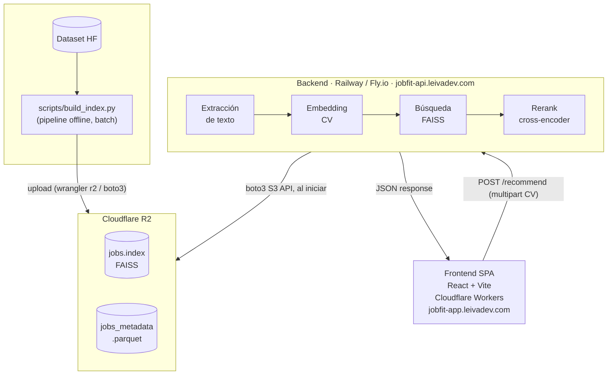

# JobFit

> Motor de Recomendación de Vacantes de TI basado en Representaciones Vectoriales Densas

Un visitante sube su CV y recibe las vacantes de TI más afines, usando **embeddings semánticos** sobre un dataset real de ofertas de empleo. Proyecto de portafolio con foco en embeddings, búsqueda vectorial y reranking, combinado con ingeniería de software (backend, frontend, despliegue, privacidad de datos de usuario).

**Estado**: en fase de diseño y scaffolding. Todavía no hay pipeline ni API funcionando — este README documenta la arquitectura acordada, no funcionalidad ya implementada.

## Arquitectura



Pipeline offline y servicio online están desacoplados: el pipeline se corre una vez (o cuando se actualiza el dataset) y produce artefactos versionados en R2; el backend solo los descarga al arrancar y los sirve desde memoria.

**No hay base de datos.** El corpus de vacantes se consulta por similitud vectorial, no con queries relacionales, y cabe entero en memoria. El CV del usuario se procesa en memoria y nunca se persiste (ver [Privacidad](#privacidad)).

## Stack

| Componente | Elección | Motivo |
| --- | --- | --- |
| Embeddings | `sentence-transformers/all-MiniLM-L6-v2` | Rápido, liviano, buen baseline |
| Reranking | Cross-encoder (`cross-encoder/ms-marco-MiniLM-L-6-v2` o similar) | Mejora precisión sobre el top-100 |
| Búsqueda vectorial | FAISS (`IndexFlatIP`, in-memory) | Suficiente para 10-20k vectores |
| Backend | FastAPI | Async, tipado, OpenAPI automático |
| Extracción CV | `pypdf`/`pdfplumber`, `python-docx` | Cobertura PDF y DOCX |
| Gestor de deps (backend) | `uv` | Rápido, lockfile, un solo binario |
| Frontend | React + Vite + Tailwind | Estándar, rápido de armar para una sola pantalla |
| Gestor de deps (frontend) | `pnpm` | Eficiente, integra bien con el ecosistema Wrangler |
| Despliegue backend | Railway o Fly.io | Soporta dependencias ML pesadas (torch, faiss) |
| Despliegue frontend | Cloudflare Workers (Static Assets) | Free tier, mismo ecosistema que R2 |
| Almacenamiento de artefactos | Cloudflare R2 | Zero egress fees, S3-compatible |

## Datos

- **Vacantes**: [`lang-uk/recruitment-dataset-job-descriptions-english`](https://huggingface.co/datasets/lang-uk/recruitment-dataset-job-descriptions-english) (~142k ofertas IT, plataforma Djinni, 2020-2023, MIT). Filtrado a 10-20k vacantes por categoría IT más representada, deduplicado.
- **Evaluación offline**: [`lang-uk/recruitment-dataset-candidate-profiles-english`](https://huggingface.co/datasets/lang-uk/recruitment-dataset-candidate-profiles-english) (~230k CVs anonimizados), nunca expuesto en producción.

## Estructura del repo

```
jobfit/
├── backend/            # FastAPI + pipeline offline (uv)
│   ├── app/             # API, extracción, embeddings, búsqueda, rerank
│   ├── scripts/          # build_index.py (pipeline offline, batch)
│   └── tests/
├── frontend/            # React + Vite, desplegado en Cloudflare Workers
├── docs/
│   ├── adr/              # Architecture Decision Records
│   ├── design/           # Contrato de API, scope, evaluación, frontend
│   └── research/         # Investigación abierta (aún no son decisiones)
└── CONTEXT.md           # Vocabulario de dominio compartido
```

## Desarrollo local

### Backend

```bash
cd backend
uv sync
uv run pytest
uv run ruff check .
```

### Frontend

```bash
cd frontend
pnpm install
pnpm dev
```

## Privacidad

Cualquier persona puede subir su CV real a un demo público. Para asegurar privacidad:

- El CV se procesa **en memoria**, nunca se escribe a disco ni se persiste.
- No se loggea el contenido del CV, solo métricas agregadas (tamaño, tiempo de proceso, errores).
- Rate limiting en el endpoint público, límite de tamaño de archivo y validación de tipo MIME.

## API

Ver [`docs/design/api-contract.md`](docs/design/api-contract.md) para el contrato completo de `/recommend` y `/health`.

## Evaluación

Métricas offline (Precision@10, Recall@10, MRR) sobre el dataset de CVs reales, comparando bi-encoder solo vs. bi-encoder + cross-encoder rerank. Metodología completa en [`docs/design/evaluation.md`](docs/design/evaluation.md); resultados documentados aquí una vez implementada la Fase 8 del plan.

## Estado del proyecto

Ver `docs/adr/` para las decisiones de arquitectura ya tomadas y su justificación. El plan completo (fases, alcance, decisiones abiertas) se gestiona fuera de este repo como documento de diseño; este README se actualiza a medida que cada fase se implementa.

## Licencia

[MIT](LICENSE).
