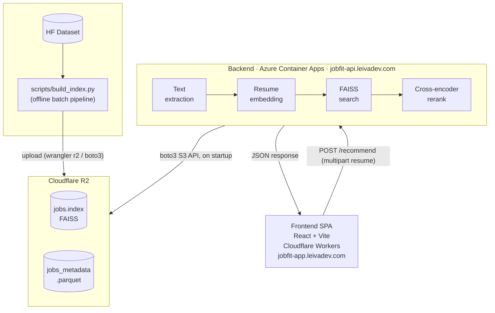

# JobFit

> Dense Vector Representation-based IT Job Recommendation Engine

A visitor uploads their resume and receives the most relevant IT job postings, using **semantic embeddings** over a real job listings dataset. Portfolio project focused on embeddings, vector search, and reranking, combined with software engineering (backend, frontend, deployment, user data privacy).

**Status**: the offline pipeline (Phase 1) is implemented; the backend API and frontend are not yet built. This README documents the agreed-upon architecture for the parts not yet implemented.

## Architecture



The offline pipeline and the online service are decoupled: the pipeline runs once (or whenever the dataset is updated) and uploads its artifacts to a fixed key in R2, overwriting the previous run (see ADR-0006); the backend only downloads them at startup and serves them from memory.

**There is no database.** The job corpus is queried via vector similarity, not relational queries, and fits entirely in memory. The user's resume is processed in memory and never persisted (see [Privacy](#privacy)).

## Stack

| Component | Choice | Reason |
| --- | --- | --- |
| Embeddings | `sentence-transformers/all-MiniLM-L6-v2` | Fast, lightweight, good baseline |
| Reranking | Cross-encoder (`cross-encoder/ms-marco-MiniLM-L-6-v2` or similar) | Improves precision over the top-20 |
| Vector search | FAISS (`IndexFlatIP`, in-memory) | Sufficient for 10-20k vectors |
| Backend | FastAPI | Async, typed, automatic OpenAPI |
| Resume extraction | `pypdf`, `python-docx` | PDF and DOCX coverage |
| Dependency manager (backend) | `uv` | Fast, lockfile, single binary |
| Frontend | React + Vite + Tailwind | Standard, quick to build for a single screen |
| Dependency manager (frontend) | `pnpm` | Efficient, integrates well with the Wrangler ecosystem |
| Backend deployment | Azure Container Apps | CPU-only workload, scale-to-zero, perpetual free grant covers demo traffic |
| Frontend deployment | Cloudflare Workers (Static Assets) | Free tier, same ecosystem as R2 |
| Artifact storage | Cloudflare R2 | Zero egress fees, S3-compatible |

## Data

- **Job postings**: [`lang-uk/recruitment-dataset-job-descriptions-english`](https://huggingface.co/datasets/lang-uk/recruitment-dataset-job-descriptions-english) (~142k IT postings, Djinni platform, 2020-2023, MIT). Filtered to the most represented `Primary Keyword` categories (QA, DevOps, iOS/Android, Data, main languages), deduplicated — see `docs/design/phase-1-offline-pipeline.md`.
- **Offline evaluation**: [`lang-uk/recruitment-dataset-candidate-profiles-english`](https://huggingface.co/datasets/lang-uk/recruitment-dataset-candidate-profiles-english) (~230k anonymized resumes), never exposed in production.

## Repo structure

```
jobfit/
├── backend/            # FastAPI + offline pipeline (uv)
│   ├── src/backend/      # installable package: config, API, domain (extraction, embeddings, search, rerank)
│   ├── app/              # offline pipeline: dataset, text, embeddings, index, storage
│   ├── scripts/          # build_index.py (offline batch pipeline)
│   └── tests/
├── frontend/            # React + Vite, deployed on Cloudflare Workers
├── docs/
│   ├── adr/              # Architecture Decision Records
│   ├── design/           # API contract, scope, evaluation, frontend
│   └── research/         # Open research (not yet decisions)
└── CONTEXT.md           # Shared domain vocabulary
```

## Local development

### Backend

```bash
cd backend
uv sync
uv run pytest
uv run ruff check .
```

### Frontend

```bash
cd frontend
pnpm install
pnpm dev
```

## Privacy

Anyone can upload their real resume to a public demo. To ensure privacy:

- The resume is processed **in memory**, never written to disk or persisted.
- Resume content is not logged, only aggregate metrics (size, processing time, errors).
- Rate limiting on the public endpoint, file size limit, and MIME type validation.

## API

See [`docs/design/api-contract.md`](docs/design/api-contract.md) for the full `/recommend` and `/health` contract.

## Evaluation

Offline metrics comparing bi-encoder only vs. bi-encoder + cross-encoder rerank, on the real resume dataset. Full methodology in [`docs/design/evaluation.md`](docs/design/evaluation.md).

| metric | definition |
| --- | --- |
| Precision@10 | Fraction of the top 10 returned jobs that are relevant |
| MRR@10 | 1 / rank of the first relevant job in the top 10 (0 if none) |
| NDCG@10 | Precision@10, weighted so relevant jobs ranked higher count more |
| MAP@10 | Average precision at each relevant job's rank, within the top 10 |
| HitRate@10 | 1 if any relevant job appears in the top 10, else 0 |

**~1% of the candidate dataset** (N=1,280, automated weak label = shared `Primary Keyword`, `scripts/evaluate_scale.py`):

| metric | baseline | rerank | delta |
| --- | --- | --- | --- |
| Precision@10 | 0.649 | 0.664 | +0.015 |
| MRR@10 | 0.746 | 0.766 | +0.019 |
| NDCG@10 | 0.650 | 0.669 | +0.018 |
| MAP@10 | 0.565 | 0.586 | +0.022 |
| HitRate@10 | 0.920 | 0.920 | +0.000 |

Reranking improves most metrics over the bi-encoder baseline alone, at a real latency cost (`scripts/measure_latency.py`, CPU, matching the production deployment):

| stage | mean | p95 |
| --- | --- | --- |
| bi-encoder only | 67ms | 136ms |
| bi-encoder + cross-encoder rerank | 2099ms | 2375ms |

The cross-encoder is the whole cost: +2s/request for a 1.5-3% quality gain. The shortlist reranked was shrunk from 100 to 20 jobs specifically to bring this down from an initial ~11s/request to something tolerable for a synchronous request.

## Project status

See `docs/adr/` for architecture decisions already made and their rationale. The full plan (phases, scope, open decisions) is managed outside this repo as a design document; this README is updated as each phase is implemented.

## License

[MIT](LICENSE).
